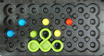
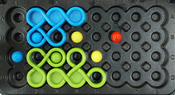
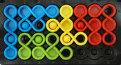

#### Objective 

The game is a puzzle; the objective is to place all eight colored
playing pieces onto a board comprising 32 locations (indents) on which
up to seven colored pegs may be arranged.  The player must place the
pieces such that they fit together correctly on the board, without
overlaps or gaps. Also, each of the pegs must be surrounded by a piece
of the same colour, meaning the piece must have a hole in the
necessary place. In the photo above, a blue peg at upper right is
surrounded by a blue piece, with the peg fitting exactly into a hole
in the blue piece.  The player will need to place the green and red
pieces so that they fit neatly on the green and red pegs, and to
complete the game will need to ensure that all pieces are placed with
no overlaps and no gaps.

A completed game:

#### Challenges

A game starts with a challenge which involves zero or one pieces and
one or more pegs being placed.  Here is what the game above starts
like, ready to be solved (this happens to be challenge 1 that comes
with the game):

Notice that this particular challenge starts with one piece placed and
six pegs placed.  Note that the more constrained the player is, the
fewer options they have, and consequently the solution to the
challenge is, in general, simpler.  For example, many of the 'Wizard'
level challenges that come with the game (e.g. numbers 118-120) have
just three pegs placed, which leaves the player with a large number of
placements to choose from, and thus creates a much more challenging
game.  On the other hand, some of the 'Starter' challenges
(e.g. number 17) have all seven pegs and one piece placed,
significantly reducing the player's options and consequently making
the challenge far easier.

#### Solutions

Each challenge has just one solution.  When comparing solutions, we
ignore piece rotations that take up the same space on the board.  Such
rotations are described as *symmetric*, which is defined in more
detail [below](#strict-symmetry).

The following sequence shows one possible progression of a solution to the game
above (note that the order in which the pieces are played is not important; this
is just one possible ordering).

#### Board

The game is played on a board comprised of 32 **locations** arranged
in a 8x4 grid.  In the plastic game, each location consists of a
circular depression in the plastic into which a piece may fit, and in
the center of the depression is a hole (well) into which a **peg** may
be inserted at the start of the game, to form part of the challenge.
Locations are encoded as a digit (`1` to `8`) followed by a letter
(`A` to `D`).  For example, in the game above, the green peg is in position `3C`
and the red peg is in position `6B`.

#### Pieces

The game comprises **8 playing shapes**, each of which is made of
plastic and consists of three, four, or five connected loops (see the
photo above). The pieces fit neatly into the depressions on the board
formed by the 32 locations.  Each of the loops is either filled or has
a hole.  In the game above, the blue piece at the left has four loops,
three of which are filled and one of which has a hole.  When pieces
are placed, the location and orientation must be chosen such that
loops that are filled are not placed on locations that contain pegs.
In the game above, for example, in the first step, a blue piece placed is
carefully positioned so that one of its holes fits over the blue peg at
location `2B`.

Each piece can be **flipped** and **rotated** at 90 degree increments,
allowing for 8 different **orientations** (four rotations and a flip
with four rotations).  The following illustration shows all 64
possible combinations of the 8 pieces and 8 orientations.  The first
four columns show four rotations.  The piece is then flipped and
rotated four more times.  So the fifth image in the top row (`a4`)
illustrates the flip of the left-most image (`a0`).

##### Strict Symmetry

Notice that piece `c` and piece `h` are symmetric, so the flipped
orientations are the identical to the unflipped (for example `c0` is
identical to `c4`, and `h0` is identical to `h4`).  We describe that
as *'strictly [symmetric](https://en.wikipedia.org/wiki/Symmetry)'*.  We ignore the redundant rotations
with higher numberings (e.g. `c4` is ignored because it is redundant
with respect to `c0` and has a higher rotation number).

##### Weak Symmetry

Notice that *if we ignore the holes* , aside from `a`, `d` and `g`,
all pieces exhibit symmetry.  We describe these as *'weakly
[symmetric](https://en.wikipedia.org/wiki/Symmetry)'*, and thus take up exactly the same space on the
board.  We ignore the redundant rotations with higher numberings (e.g.
if a solution could be made with either`e0` or `e7` then we ignore the
solution with `e7` because it is weakly symmetric and has a higher
rotation number).  Other examples include `b0` & `b2`, `c0` & `c2`,
`f0` & `f6`, and `h0` & `h2`, each of which are identical pairs if we
ignore the holes.

#### Pegs

The game has *seven* pegs.  There are two green, two blue and two
yellow pegs, but just one red peg.  The pegs are not placed by the
player during the game, but rather, they one or more pegs is placed on
the board at the start of the game as part of the challenge.  In the
example above, two blue, two yellow, one green and one red peg are
placed to form the challenge, as well as a green piece.  The player
has to place the remaining pieces.  The particular challenge
illustrated above is challenge one in the booklet that comes with the
IQ-Twist game.

#### Legal Piece Placements

For a piece placement to be valid, the following must be true:
* All loops comprising each piece must be placed on valid board
  locations (**no part of a piece may be off the board**).
* All loops comprising each piece must be placed on vacant board
  locations (**pieces may not overlap**).
* No piece may be placed over a peg, except where the peg is the same
  color *and* the location of the peg coincides with a loop that has
  a hole.  For example, in the game above, the blue piece at the left
  is placed such that it fits on the peg at location `1C`.

#### Encoding Game State

Game states are encoded as strings.  Your game will need to be able to
initialize itself using these strings and some of your tasks relate
directly to these strings.

##### Placement Strings

A placement string consists of between one and eight (inclusive)
**piece placements** (pieces `a` to `h`), and between zero and seven
**peg placements**. The placement string may not include any piece
twice, and may not include more pegs than are available (so it may not
include two or more red pegs since there is only one in the game, and
it may not include three or more of the other colored pegs, since
there are only two each of those in the game).  A completed game
must include eight piece placements.  Each piece placement is described
using four characters.  For example, the game described above is
characterized (when complete) by the string
`a7A7b6A7c1A3d2A6e2C3f3C4g4A7h6D0i6B0j2B0j1C0k3C0l4B0l5C0`.  Note
that the placement string is ordered (piece `a` first, and piece `l`
last), which is a requirement for valid placement strings.

##### Piece Placement Strings

A piece placement string consists of four characters describing the location 
and orientation of one particular piece on the board:

* The first character identifies **which of the eight shapes** is being placed (`a` to `h`).
* The second character identifies **which column** the left of the piece is in (columns are labelled `1` to `8`).
* The third character identifies **which row** the top of the piece is in (rows are labelled `A` to `D`).
* The fourth character identifies **which orientation** the piece is in (`0` to `3` for four rotations, and then `4` to `7` for four flipped rotations, see the illustration of all 64 piece orientations above).

The image above shows the first and fourth characters for each of the pieces in
each of their orientations (64 in total). For example, at top left, 'a0' describes piece 'a'
at orientation '0'.  Below it, 'b0' describes piece 'b' at orientation '0'.  At
the bottom right 'h7' describes piece 'h' at orientation '7'.  And so on.   A piece
placement string starts and ends with these two characters and has two more in 
between which describe where the piece is placed.

##### Peg Placement Strings

Peg placement strings follow exactly the same format as piece
placement strings, however, pegs use the characters `i` (red), `j`
(blue), `k` (green), and `l` (yellow), and the rotation is always `0`
for a peg placement, since it makes no sense to rotate a peg, which is
round.

##### Example Placement String

The progression of twelve images above shows the progression of the
game `a7A7b6A7c1A3d2A6e2C3f3C4g4A7h6D0i6B0j2B0j1C0k3C0l4B0l5C0`,
starting with the starting state `f3C4i6B0j2B0j1C0k3C0l4B0l5C0`, then
adding piece `d` with its left in column `2`, its top in row `A`, and rotated
and flipped to rotation `6`, which is encoded as a piece placement of `d2A6`.
The  resulting placement string is `d2A6f3C4i6B0j2B0j1C0k3C0l4B0l5C0`, etc.

